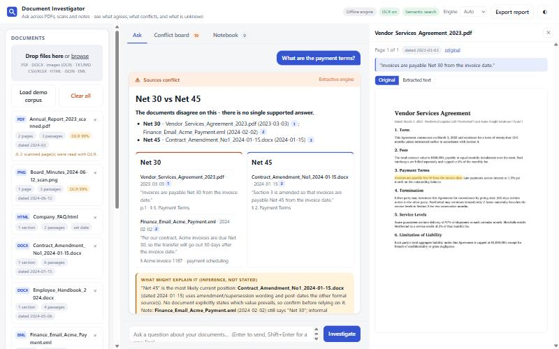
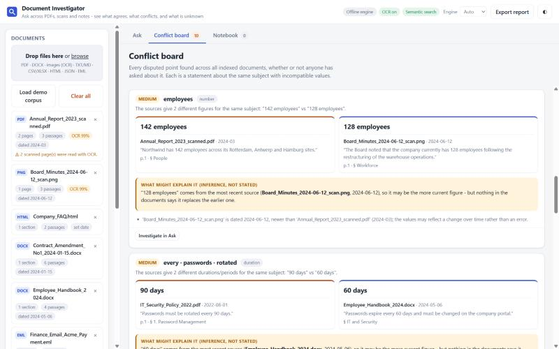
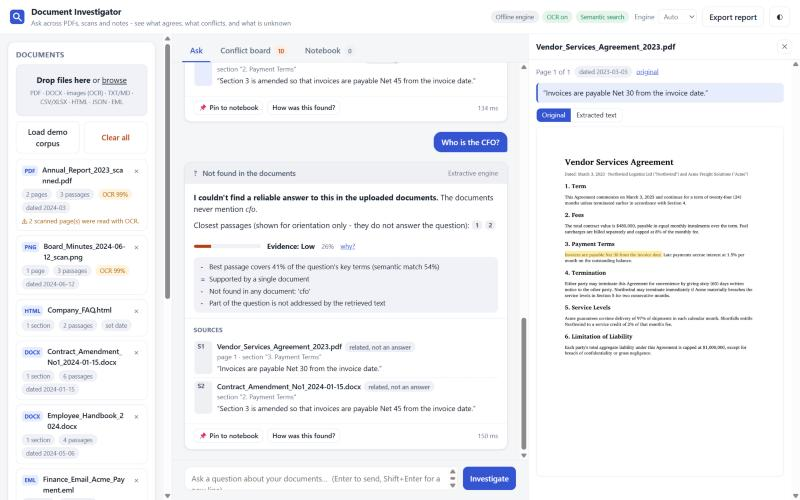
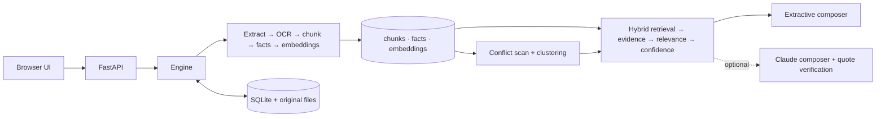

# Intelligent Document Investigator

> **ALG-AI-02** - upload PDFs, scans, Word files, e-mails, spreadsheets and notes; ask questions in plain English; get answers
> with the exact supporting passage - and when documents **disagree** or simply **don't say**, get that instead of a confident guess.



| | |
|---|---|
| **Works with no API key, no cloud, no GPU** | OCR, embeddings, conflict detection, confidence and abstention are all local. Claude is an optional upgrade. |
| **Never a silent winner** | Disagreements become a *disputed point* with positions, sources, dates and a labelled "what might explain it". |
| **Grounded by construction** | Every citation is an exact slice of the stored page text; the viewer highlights it on the original page image (PDF text search / OCR boxes on scans). |
| **Honest about uncertainty** | Four outcomes - answered · partial · **conflict** · **not found** - plus a calibrated confidence with the reasons spelled out. |
| **Tested** | 105 automated tests + a 56-question evaluation across three corpora (numbers and caveats below). |

---

## 1. Run it (2 minutes)

```bash
python -m venv .venv && . .venv/bin/activate          # Windows: .venv\Scripts\activate
pip install -r requirements.txt
python samples/generate_samples.py                     # builds the 11-file demo corpus (also done automatically by the tests)
python -m investigator.main                            # http://127.0.0.1:8000
```

Click **Load demo corpus**, then pick a suggested question. Tested on Python 3.14 / Windows 11; the Dockerfile targets 3.12.

* **First start downloads one model** (BAAI/bge-small-en-v1.5, ~130 MB, via `fastembed`). Until it is ready the app serves
  keyword-only retrieval and the header pill says so; set `DOCINV_DENSE=0` to skip it entirely.
* **Optional Claude mode:** `export ANTHROPIC_API_KEY=...` (default model `claude-opus-5-5`, `DOCINV_MODEL` / `DOCINV_EFFORT` to change).
  The *Engine* selector in the header switches between Auto / Offline / Claude per question.
* **Docker:** `docker build -t investigator . && docker run -p 7860:7860 -v docinv:/data investigator`
  (Dockerfile is provided but was **not built in the authoring environment**; it bakes the OCR and embedding models into the image).
  The app is a single ASGI process, so it deploys unchanged to Render / Railway / Fly / Hugging Face Spaces (Docker) - set `PORT`.
  No hosted demo URL is included with this submission.

### Suggested 4-minute demo

| Step | Do this | What it shows |
|---|---|---|
| 1 | *Load demo corpus* → look at the left panel | 11 files, 9 formats: born-digital PDF, **scanned PDF**, **PNG scan** (OCR badges + confidence), DOCX, EML, MD, TXT, CSV, HTML |
| 2 | **What are the payment terms?** | Three documents, **two positions** (Net 30 contract + e-mail, Net 45 amendment); resolution note says the amendment is the most likely current position *and* that a later informal e-mail still says Net 30. Click a source → the PDF page opens with the sentence highlighted |
| 3 | **How many employees does Northwind have?** | 142 (scanned PDF, March) vs 128 (PNG board minutes, June) - both read by OCR; hint says the values may reflect change over time |
| 4 | **What marketing budget did the board approve?** | Single-source answer from the scan; the viewer draws the OCR box on the original image; confidence mentions OCR quality |
| 5 | **What was the root cause of the September outage?** | Corroborated by two documents (confidence goes up) while the *same two documents disagree* on date and duration - visible on the **Conflict board** tab |
| 6 | **Who is the CFO?** · **What is the share price of Northwind?** | "Not found": names the terms that appear in no document, shows nearest passages *labelled as not an answer* |
| 7 | **Pin** findings → *Notebook* → **Export report** | Markdown report with every finding, caveat, quote and the corpus-wide conflict register |
| 8 | Click a document's **date chip** and change it | Conflict reasoning re-runs (e.g. which source is newer) |

---

## 2. How it meets the brief

| Requirement (PS ALG-AI-02) | Implementation |
|---|---|
| **Multiple document formats** | PDF (text, scanned, mixed), DOCX (headings, lists, tables, embedded images), PNG/JPG/WEBP/BMP/TIFF/GIF (multi-frame), TXT/MD/LOG, CSV/TSV/XLSX, HTML, JSON, EML |
| **Extraction / indexing** | PyMuPDF text with font-size heading detection and table extraction; per-page OCR fallback (RapidOCR, ONNX, offline) with paragraph reconstruction; section-aware chunking; typed-fact extraction; BM25 + char n-gram + dense index |
| **Natural-language Q&A** | Question analysis (how many / how long / when / who / yes-no), hybrid retrieval, sentence-level evidence selection, follow-up handling, extractive composer **or** Claude composer |
| **Source / section references** | Document · page · section · exact quote · character offsets; click-through viewer with highlight on the page image |
| **Conflict detection** | Corpus-wide scan at upload time (Conflict board) **and** per-question relevance; clustered into disputed points with positions; guards against false positives |
| **Uncertainty handling** | Abstention ("not found") with missing-term report; confidence with itemised reasons; OCR-quality penalty; conflict cap; low-confidence caveats |
| **Bonus: identify conflicting documents, communicate uncertainty** | The whole design - see §3 |

---

## 3. What makes it different

1. **Disputed points, not document pairs.** Pairwise conflicts are merged: *contract says Net 30, amendment says Net 45, an e-mail says Net 30 again* → one point, two positions, three sources.
2. **Reasoning about *why* they differ - without overclaiming.** Newer date, amendment wording ("is amended so that…"), formal vs informal source, same-document typo, time-scoped values, draft file names, low OCR confidence. Always labelled *inference*, always ends with "no document says which prevails - confirm".
3. **Precise because it is typed.** `sixty (60) days` = `2 months` = `60 days`; `Net 30`; `weekly` = every 7 days; `$1.5 million` vs `$1,250,000`; dates with precision awareness.
4. **A precision-first guard set.** Different quarters/years/entities, as-of dates, table rows, actual-vs-spec values and workers-vs-visitors rules are *not* flagged (see tests).
5. **Confidence from evidence, not from rank.** A high-ranked passage in a corpus that lacks the answer doesn't look confident; unknown terms ("cfo") are detected corpus-wide.
6. **LLM output is verified, not trusted.** Every quote must appear verbatim in the cited passage; failures are dropped and lower confidence; refusals/timeouts fall back to the extractive engine.
7. **Investigation workflow**, not just chat: viewer with highlights, conflict board, editable document dates, pinned notebook, exportable report, retrieval trace ("How was this found?").




---

## 4. Architecture (details: [docs/ARCHITECTURE.md](docs/ARCHITECTURE.md))



Stack: Python 3.12+, FastAPI, PyMuPDF, python-docx, openpyxl, RapidOCR (PP-OCR via ONNX Runtime), scikit-learn (char n-gram TF-IDF),
fastembed (bge-small), SQLite, vanilla JS (no build step), optional Anthropic SDK.

**Major technical decisions** (each with trade-offs in the architecture doc): deterministic core with optional LLM · retrieval emits relevance
signals for calibration · typed-fact conflict detection with scope guards · conflict clustering · citation offsets as an invariant ·
derive-on-start persistence (fix a parser bug without re-uploading).

---

## 5. Testing & evaluation

```bash
python -m pytest tests -q          # 105 tests, 30-120 s depending on the machine, no network, no API key
python eval/run_eval.py            # dev corpus, lexical vs hybrid retrieval  -> eval/RESULTS.md
python eval/run_eval.py --holdout  # held-out corpus 1 (lab safety / grants) -> eval/RESULTS_HOLDOUT.md
python eval/run_eval.py --holdout2 # held-out corpus 2 (civil engineering)   -> eval/RESULTS_HOLDOUT2.md
python eval/run_eval.py --llm      # additionally evaluate the Claude composer (needs ANTHROPIC_API_KEY)
```

### Results - and how much to trust them

| Corpus | Questions | **First run** (before any fixes) | After fixing the failures it exposed |
|---|---|---|---|
| Development (Northwind, 11 files) | 28 | - (built alongside the system) | 100 % · conflict recall/precision 100 % / 100 % |
| Held-out 1 (lab, 7 files) | 15 | **60 %** · conflict recall 60 % | 100 % |
| Held-out 2 (civil engineering, 6 files) | 13 | **77 %** · conflict recall 50 % | 92 % (1 miss: a missing headline value) |

Be careful with the right-hand column: after each held-out run I fixed the *general* causes it exposed (non-numeric frequencies
like "weekly", years inside date values being mistaken for scoping qualifiers, generic nouns such as "period" counted as missing
terms, document names not searchable, unit nouns missing from counts), so those numbers are no longer independent.
**The first-run column (60 % → 77 % on unseen corpora, with 0 false conflicts throughout) is the honest estimate** of what to expect on a new
corpus with the offline engine. Raw first-run reports are kept in `eval/holdout*/RESULTS_initial.md`. Across all runs: 0 false
conflicts on non-conflict questions, every unanswerable question refused, and 100 % of citations verbatim at their stated offsets.

**Not measured:** the Claude composer against the live API (no API key was available while building). Its *logic* is tested with a fake
client (quote verification, fabricated-quote rejection, partial fabrication lowering confidence, conflict adjudication/dismissal,
refusal/truncation/timeouts → fallback, hostile-document handling, request shape), but answer quality with a real model is unmeasured.

### Edge cases covered by tests

| Area | Cases |
|---|---|
| Files | unsupported type, empty file, corrupt PDF, password-protected PDF, 3 text encodings, invalid JSON, blank image (no text → warning, not failure), scanned PDF pages, duplicate upload (hash), same name different content, one bad file in a batch |
| Conflicts | unit conversion (60 days = 2 months), different quarters/years/entities, as-of dates, event-date conflicts, table rows, same-document inconsistency, antonym assertions, three-way clusters, date edits changing reasoning, deleting a document removes its conflicts |
| Answers | unanswerable questions, terms absent from every document, period-scoped questions (January) ignoring unrelated disputes, elliptical vs self-contained follow-ups, empty/oversized questions, no documents loaded |
| Grounding / safety | every citation verbatim at its offsets, prompt-injection text inside a document (offline and Claude paths), fabricated LLM quotes, UI never uses `innerHTML` for document text |
| API | multi-upload, validation errors (400/404/415/422), page image rendering for PDF and image, notebook + Markdown export |

---

## 6. Known limitations

* **English only**; OCR is printed text (handwriting, heavy skew or very low resolution degrade results - the UI shows OCR confidence and lowers answer confidence accordingly).
* **The offline engine returns supporting sentences, not synthesised prose**, and its yes/no reasoning is limited to retrieval ("Are hard hats mandatory?" returns the sentence). Claude mode adds synthesis.
* **Conflict detection covers typed values (money, %, durations, dates, counts) and clear polarity/antonym assertions.** Purely semantic contradictions
  ("approved" vs "put on hold"), qualitative claims and cross-unit comparisons beyond time (currency, mass...) need the Claude adjudicator or are missed. Number *words* are only parsed next to a unit ("sixty days"), not as bare counts ("three violations").
* **Retrieval vocabulary gaps** in lexical mode (e.g. "due" ↔ "deadline" is handled by a small synonym list, not in general); the dense model closes most but not all gaps. First-run held-out accuracy (60-77 %) shows this is the weakest area.
* **PDF tables / multi-column layouts** are handled by PyMuPDF heuristics; complex layouts may read out of order. Charts/figures are not interpreted unless they contain text.
* Single user, single process, no authentication; SQLite; the conflict scan is recomputed on every upload (fine for hundreds of documents, not millions).
* The Dockerfile and the live Claude path were not exercised in the authoring environment.

### Future improvements
LLM-based NLI to verify every rule-engine candidate at ingest · cross-encoder reranker · layout-aware PDF parsing and chart-to-table extraction ·
multilingual OCR + embeddings · "mark as resolved / authoritative source" feedback that feeds resolution reasoning · incremental conflict scan ·
user accounts and per-case workspaces · larger public benchmark evaluation (e.g. adversarial conflicting-document QA sets).

---

## 7. Disclosures

**External services / models / data**
* **Anthropic Claude API** - *optional*, only when `ANTHROPIC_API_KEY` is set; sends retrieved passages (not whole files) and the question. Off by default.
* **RapidOCR** (PP-OCR models, Apache-2.0) and **BAAI/bge-small-en-v1.5** via **fastembed** (MIT) - run locally; the bge model is downloaded once from Hugging Face.
* Libraries: FastAPI, PyMuPDF (AGPL/commercial - review before commercial redistribution), python-docx, openpyxl, scikit-learn, Pillow, NumPy, pytest.
* **No external datasets.** All demo and evaluation documents are fictional and generated by `samples/generate_samples.py`, `eval/holdout/make_holdout.py`, `eval/holdout2/make_holdout2.py`.

**AI-assisted components.** This project was built with an AI coding assistant (Claude Code): architecture iteration, implementation, tests and documentation
were produced in an interactive session with a human requester. The test suite and the three evaluation corpora were used to verify behaviour; the
held-out corpora and first-run numbers above are reported specifically to avoid overstating results. At runtime the only AI-generated text is the optional
Claude composer's output, which is constrained to verified quotes from the uploaded documents.

---

## 8. Repository layout

```
investigator/      extract.py · ocr.py · chunking.py · facts.py · conflicts.py · retrieval.py · answer.py · llm.py
                   engine.py · store.py · report.py · app.py · main.py · static/ (index.html, app.js, style.css)
samples/           generate_samples.py → corpus/ (11 mixed-format files) · adversarial/ (prompt-injection memo)
eval/              questions.json · ground_truth_conflicts.json · run_eval.py · RESULTS*.md · holdout/ · holdout2/
tests/             105 tests (unit, conflict guards, demo-corpus answers, Claude path with fake client, API)
docs/              ARCHITECTURE.md · screenshots/
Dockerfile · requirements.txt
```

**Configuration** (environment): `DOCINV_DATA_DIR`, `DOCINV_MAX_UPLOAD_MB` (40), `DOCINV_MAX_PDF_PAGES` (300), `DOCINV_DENSE` (`auto`/`0`), `DOCINV_DENSE_MODEL`,
`DOCINV_OCR` (`on`/`off`), `ANTHROPIC_API_KEY`, `DOCINV_MODEL` (`claude-opus-5-5`), `DOCINV_EFFORT` (`medium`), `HOST`, `PORT`.

**API** (all JSON unless noted): `GET /api/status` · `GET/POST/DELETE /api/documents` · `PATCH /api/documents/{id}` (document date) · `POST /api/demo/load` ·
`GET /api/documents/{id}/pages/{n}` · `GET …/pages/{n}/image?start&end` (PNG with highlight) · `GET /api/documents/{id}/file` · `POST /api/ask` ·
`GET /api/conflicts` · `GET/POST /api/notebook` · `DELETE /api/notebook/{id}` · `GET /api/notebook/export` (Markdown).
