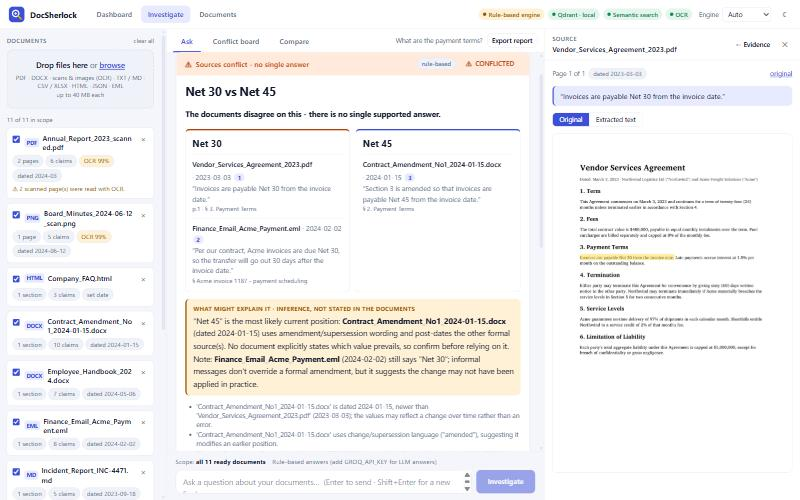
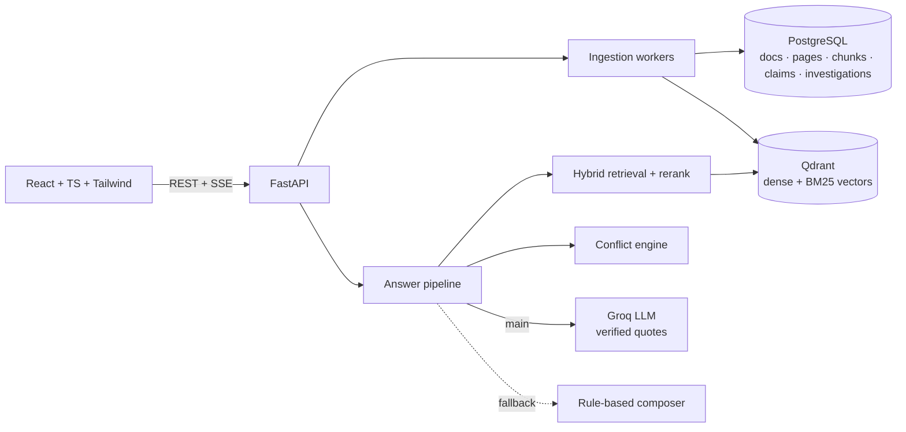

# DocSherlock

> **Evidence-grounded document investigation.** Upload PDFs, scans, Word files, e-mails and spreadsheets; ask questions in plain English;
> get answers with the exact supporting passage. When documents **disagree** you get every position with its sources - and when the
> documents **don't say**, you get "not found" instead of a confident guess. (ALGOTHON-26 · ALG-AI-02)



| | |
|---|---|
| **Groq LLM first, rules as the safety net** | Answers are written by Groq (`openai/gpt-oss-120b`, strict JSON schema). If the key is missing, the rate limit is hit or the model fails, the deterministic rule-based engine answers instead - visibly flagged. |
| **Never trusts the model** | Every claim must carry a *verbatim* quote from a retrieved passage; quotes are verified against the stored page text, unverifiable ones are dropped and the answer is withheld if nothing verifiable remains. |
| **Conflicts are a feature** | Disputed points are detected across the whole workspace, clustered into positions, and explained (newer date, amendment wording, formal vs informal source) - always labelled *inference*. |
| **Five honest outcomes** | `HIGH · MEDIUM · LOW · CONFLICTED · INSUFFICIENT`, each with the reasons behind it. |
| **Investigation workflow** | Live pipeline stages (SSE), source viewer with the quote highlighted on the original page, conflict board, document comparison, evidence matrix, investigation history, pin/notes, Markdown report. |

---

## Contents
1. [Run it](#1-run-it) · 2. [Groq setup](#2-groq-setup-what-you-need-to-do) · 3. [Deploy on Render](#3-deploy-on-render) · 4. [How it maps to the plan](#4-how-it-maps-to-the-plan)
5. [Architecture](#5-architecture) · 6. [Testing & evaluation](#6-testing--evaluation) · 7. [Limitations](#7-known-limitations) · 8. [Disclosures](#8-disclosures) · 9. [Repo layout](#9-repository-layout)

---

## 1. Run it

### Option A - local development (SQLite + embedded Qdrant, no Docker needed)
```bash
# backend  (Python 3.12+)
cd backend
python -m venv .venv && . .venv/bin/activate        # Windows: .venv\Scripts\activate
pip install -r requirements.txt
python ../sample-documents/generate.py               # builds the 11-file sample set
cp .env.example .env                                  # then put your GROQ_API_KEY in it (see §2)
uvicorn app.main:app --reload --port 8000

# frontend (Node 20+), in a second terminal
cd frontend
npm install
npm run dev                                           # http://localhost:5173  (proxies /api to :8000)
```
Open the app → **Load the sample set** → ask *"What are the payment terms?"*

To serve the UI from the API instead (single process): `cd frontend && npm run build`, then open http://localhost:8000.

### Option B - the full stack in Docker (PostgreSQL + Qdrant + app)
```bash
GROQ_API_KEY=gsk_... docker compose up --build        # http://localhost:8000
```

### Zero-config behaviour
| If this is missing… | …the app does this |
|---|---|
| `GROQ_API_KEY` | rule-based engine answers (header pill says so) |
| `DATABASE_URL` | SQLite file in `backend/data/` |
| `QDRANT_URL` | embedded local Qdrant in `backend/data/qdrant/` |
| embedding models still downloading (first start, ~150 MB) | keyword retrieval until ready; documents are re-indexed automatically afterwards |

---

## 2. Groq setup (what you need to do)

1. Create an account and an API key at **https://console.groq.com/keys**.
2. Put it in `backend/.env`:
   ```ini
   GROQ_API_KEY=gsk_xxxxxxxxxxxxxxxx
   GROQ_MODEL=openai/gpt-oss-120b          # default. Cheaper/faster: openai/gpt-oss-20b
   GROQ_FALLBACK_MODEL=llama-3.3-70b-versatile
   ```
3. **Verify it** (10 seconds, never prints your key):
   ```bash
   cd backend && python scripts/check_groq.py
   ```
   It checks the key, the model, strict structured output, and runs a real two-document conflict question end to end.
4. Restart the backend. The header pill changes from *Rule-based engine* to *Groq · gpt-oss-120b*.

**Free-tier note:** Groq's free plan is rate-limited (the docs list 30 requests/min and ~8K tokens/min for the gpt-oss models). One answer uses roughly
2-4K tokens, so a couple of questions per minute is fine; beyond that DocSherlock waits out short limits and otherwise falls back to the rule-based
engine with a visible note ("The LLM rate limit was reached…"). A paid tier removes this.

**Model behaviour:** `gpt-oss-*` models use constrained decoding (`json_schema`, `strict: true`) and `reasoning_effort=low`; other models (e.g. Llama)
use `json_object` mode with the schema in the prompt. Either way the output is validated and every quote is re-verified locally.

---

## 3. Deploy on Render

Full step-by-step guide: **[docs/DEPLOY_RENDER.md](docs/DEPLOY_RENDER.md)**. Short version:

**All-free, all-on-Render setup (default `render.yaml`):** one free web service (UI + API) + Render free PostgreSQL (expires after 30 days; Neon is a no-expiry alternative) + Groq free tier.

1. Push this repo to GitHub.
2. Create a Groq key.
3. Render → **New → Blueprint** → select the repo. It creates the free web service (`LOW_MEMORY=true`) and the free PostgreSQL, already linked.
4. In the service's *Environment* tab set `GROQ_API_KEY`.
5. Open the URL → **Load the sample set**. A free service sleeps after ~15 min idle (≈1 min to wake).

`LOW_MEMORY=true` turns off embeddings + reranker (keyword retrieval, no Qdrant) and shrinks OCR - measured **peak ~360 MB** on the sample set, so it fits Render's 512 MB.
With ≥ 2 GB RAM (paid) leave it `false` for semantic search + reranking (measured ~700 MB steady, ~1.0 GB peak) and optionally add Qdrant Cloud.

The Dockerfile builds the React app into the image, so one service serves UI + API, bakes the models into the image, and runs a single process.

---

## 4. How it maps to the plan

| Plan item | Status | Notes |
|---|---|---|
| React + Vite + TypeScript (+ Tailwind) | ✅ | React 19, Vite 8, TS 7, Tailwind 4; 23 component/lib tests |
| FastAPI + Pydantic + SQLAlchemy | ✅ | typed schemas, OpenAPI at `/docs` |
| PostgreSQL | ✅ | SQLAlchemy 2 + psycopg 3; SQLite fallback for zero-setup dev. PG compatibility is covered by DDL-compile tests; the live-PG test is opt-in (`TEST_DATABASE_URL`) and was **not run** in the authoring environment (no Docker daemon / Postgres available) |
| Qdrant (dense + sparse hybrid) | ✅ | one collection, named dense + BM25 sparse vectors, session/document payload filters. Embedded mode is what was exercised here; server / Cloud mode uses the same client API but was **not run** here |
| FastEmbed embeddings, hybrid search, reranker | ✅ | bge-small dense, Qdrant/bm25 sparse, MiniLM cross-encoder; fused with lexical BM25 + char n-grams by weighted RRF |
| OCR (Tesseract / PaddleOCR) | ✅ | RapidOCR (PaddleOCR models via ONNX) - no system binary |
| PyMuPDF · python-docx · scanned-PDF OCR | ✅ | + XLSX, CSV, HTML, JSON, EML, images |
| Page/section-aware chunking with offsets | ✅ | exact `page_text[start:end]` slices |
| Background ingestion with visible status | ✅ | `UPLOADED → PROCESSING → EXTRACTING → OCR → CHUNKING → EMBEDDING → INDEXING → READY/FAILED`; worker pool (Celery/Redis not needed at this scale) |
| Claim extraction | ✅ | typed claims persisted at ingest (money, %, duration, date, count); LLM returns structured claims per answer for the evidence matrix |
| Conflict detection (rules + LLM/NLI) | ✅ | rule engine finds candidates; the LLM adjudicates them and explains the likely resolution. **A firm candidate (high severity, different documents, same period) cannot be dismissed or ignored by the model** - it is still reported with the model's view attached as an *assessment* (found with a real Groq run: the model had called an amendment "a replacement" and silently answered "Net 45") |
| Uncertainty: HIGH/MEDIUM/LOW/CONFLICTED/INSUFFICIENT | ✅ | with itemised reasons; "insufficient evidence" abstention |
| Prompt-injection defence | ✅ | document text is data inside `<passage>` tags; tested on the LLM and rule paths |
| Evidence matrix, citation cards, clickable page references | ✅ | click → page image with the passage highlighted |
| Temporal reasoning / document comparison | ✅ | `/api/compare` + natural-language routing ("what changed between the 2022 and 2024 policies?") |
| Investigation history, workspace UI | ✅ | investigations, pin, notes, Markdown report |
| REST **and SSE** | ✅ | `/api/questions/stream` |
| Sessions | ✅ | anonymous per-browser workspace (`X-Session-Id`), full tenant isolation incl. Qdrant filters. **No user accounts / login** |
| Groq LLM, provider-configurable | ✅ | `LLM_PROVIDER=openai_compatible` + `LLM_BASE_URL` works for any OpenAI-compatible endpoint |
| Docker, docker-compose, Render | ✅ | files provided and syntax-validated; **images were not built** here (Docker daemon not running) |
| Alembic migrations · Celery/Redis | ⏭ | schema is created with `create_all`; background jobs use an in-process worker pool. Both are the natural next step for multi-instance scale |

**Kept from v1 because they were stronger than the plan:** conflict *clusters* with positions and resolution reasoning, scope guards against false conflicts (quarters, entities, as-of dates, table rows), verbatim-citation invariant with highlight-on-page, OCR-box highlighting, calibrated abstention with unknown-term detection, the held-out evaluation methodology, and the rule-based engine (now the fallback).

---

## 5. Architecture
Details and diagrams: **[docs/ARCHITECTURE.md](docs/ARCHITECTURE.md)**.



---

## 6. Testing & evaluation

```bash
cd backend  && pytest -q                    # 146 tests (1 opt-in live-Postgres test skipped), ~1 min, no network, no API key
cd frontend && npm test && npm run typecheck  # 23 tests
python eval/run_eval.py [--holdout|--holdout2] [--quick] [--llm]    # accuracy report -> eval/RESULTS*.md
cd backend  && python scripts/check_groq.py # live Groq smoke test (needs your key)
```

**What the backend tests cover:** text/fact extraction · every file format incl. corrupt/encrypted/blank · conflict true-positives *and* false-positive guards ·
28 question/answer behaviours on the sample corpus with a verbatim-citation invariant · Groq path with a fake client (strict vs json_object mode, retries,
rate limits, auth errors, model fail-over, invalid/truncated JSON, fabricated quotes, partially fabricated quotes, ignored conflicts, prompt injection,
token budget) · API (multi-upload, duplicates, stages, SSE, sessions/tenant isolation, report, validation) · document comparison · the real Qdrant + FastEmbed +
reranker stack (paraphrase retrieval, tenant filters, backfill and self-healing after a wiped vector store) · PostgreSQL DDL.

### Retrieval / answer accuracy (rule-based engine, through the real HTTP API)

| Corpus | Questions | Lexical | + Qdrant hybrid | + reranker | Conflict recall / precision |
|---|---|---|---|---|---|
| Development (11 mixed-format files) | 28 | 100 % | 100 % | 100 % | 100 % / 100 % |
| Held-out 1 (lab safety & grants) | 15 | 100 % | 100 % | 100 % | 100 % / 100 % |
| Held-out 2 (civil engineering) | 13 | 92 % | 92 % | 92 % | 100 % / 100 % |

Read these carefully: the system was developed against the first corpus; the two held-out corpora were written afterwards, and the **first-run** scores on them
(before any fixes) were **60 %** and **77 %** (raw reports in `eval/holdout*/RESULTS_initial.md`). The failures they exposed were fixed generically
(non-numeric frequencies, years inside date values, generic nouns, document names in the index, unit nouns), so the table above is no longer independent -
**expect something between the first-run and the final numbers on a brand-new corpus.** Across all runs: 0 false conflicts on non-conflict questions, every unanswerable
question refused, 100 % of citations verbatim at their stated offsets. The cross-encoder is accuracy-neutral on these small corpora (it only matters when there are
more candidates than slots) and costs ~1 s of CPU; it stays enabled because it is part of the design and pays off on larger workspaces.

**Not measured:** answer quality with the live Groq model (no key was available while building). The LLM path's *grounding logic* is tested exhaustively with a fake client;
run `python eval/run_eval.py --llm` (with `GROQ_API_KEY`) to measure the real thing and add the numbers here.

---

## 7. Known limitations
* **English only**; OCR is for printed text (handwriting and very low-resolution scans degrade results - the UI shows OCR confidence and the level drops accordingly).
* **Conflict detection covers typed values** (amounts, %, periods, dates, counts) and clear antonym/negation assertions. Purely semantic contradictions rely on the LLM adjudicator;
  number *words* are parsed only next to units ("sixty days"); cross-currency / non-time unit conversion is not attempted.
* The rule-based fallback returns supporting sentences, not synthesised prose, and cannot reason about yes/no questions.
* Groq free-tier limits (see §2); `gpt-oss` models spend reasoning tokens - `GROQ_REASONING_EFFORT=low` keeps latency and token use down.
* Memory: ~700 MB steady / ~1.0 GB peak with embeddings + reranker + OCR; `LOW_MEMORY=true` peaks at ~360 MB (measured; see docs/DEPLOY_RENDER.md). Single process by design (in-process worker pool, corpus cache, embedded-Qdrant mode).
* No user accounts; workspaces are anonymous browser sessions. No Alembic migrations yet.
* PDF tables / multi-column layouts rely on PyMuPDF heuristics; charts are not interpreted.

### Future improvements
Alembic migrations · Celery/Redis workers for horizontal scale · cross-encoder tuned on domain data · layout-aware PDF parsing · multilingual OCR + embeddings ·
authoritative-source feedback ("mark as resolved") feeding the resolution reasoning · login and shared workspaces · larger public benchmark evaluation.

---

## 8. Disclosures
* **Groq API** (LLM, main engine) - receives the question and the retrieved *passages* (not whole files). Off when no key is set.
* **Qdrant** (local embedded or your server / Qdrant Cloud) and **PostgreSQL** store your documents' text, vectors and metadata - on Render that data lives in the services you create.
* **FastEmbed models** (BAAI/bge-small-en-v1.5, Qdrant/bm25, Xenova/ms-marco-MiniLM-L-6-v2) and **RapidOCR** run locally; weights download once from Hugging Face / the package.
* Libraries: FastAPI, SQLAlchemy, Qdrant client, PyMuPDF (AGPL / commercial - review before commercial redistribution), python-docx, openpyxl, scikit-learn, Pillow, React, Vite, Tailwind.
* **No external datasets.** All sample and evaluation documents are fictional and generated by `sample-documents/generate.py`, `eval/holdout/make_holdout.py`, `eval/holdout2/make_holdout2.py`.
* **AI-assisted development:** built with an AI coding assistant (Claude Code) in an interactive session: architecture, implementation, tests and docs. Behaviour was verified with the test suites and the three evaluation corpora; first-run and post-fix numbers are both reported above.
  At runtime the only generated text is the Groq composer's output, constrained to verified quotes.
* v1 of this project ("Intelligent Document Investigator", single-service Python + vanilla JS) is archived in `docs/archive/`.

---

## 9. Repository layout
```
backend/
  app/
    main.py                FastAPI app, lifespan (DB init, model warm-up, vector reconcile), static UI
    api/                   documents · questions (+SSE) · investigations · conflicts/evidence/compare · health · deps (sessions)
    core/                  config (pydantic-settings) · database (SQLAlchemy engine/session)
    models/                ORM: documents, pages, chunks, claims, embedding cache, investigations, questions, citations, conflicts
    schemas/               Pydantic request/response models
    services/              extractor · ocr · chunker · facts · claims · embeddings · vectorstore · retriever · corpus (cache)
                           evidence · uncertainty · citations · extractive (rules fallback) · generator (LLM-first) · llm (Groq)
                           conflict_detector · comparison · ingestion · qa · render · report
    utils/text.py          tokenising, stemming, sentence splitting
  tests/                   146 tests            scripts/check_groq.py         requirements*.txt · .env.example
frontend/                  React + TS + Tailwind (pages: Dashboard · Investigation · Documents)
sample-documents/          generate.py → corpus/ (11 mixed-format files) · adversarial/ (prompt-injection memo)
eval/                      questions · ground truth · run_eval.py · RESULTS*.md · holdout/ · holdout2/
docs/                      ARCHITECTURE.md · DEPLOY_RENDER.md · API.md · screenshots/ · archive/ (v1)
Dockerfile · docker-compose.yml · render.yaml
```
