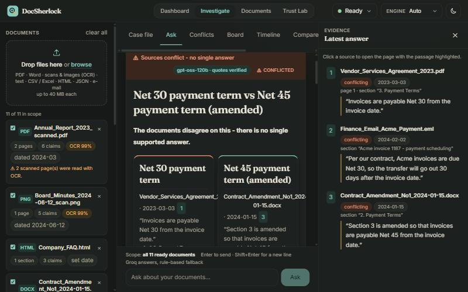
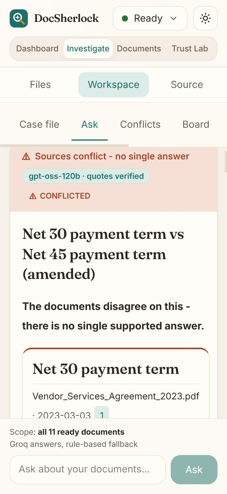
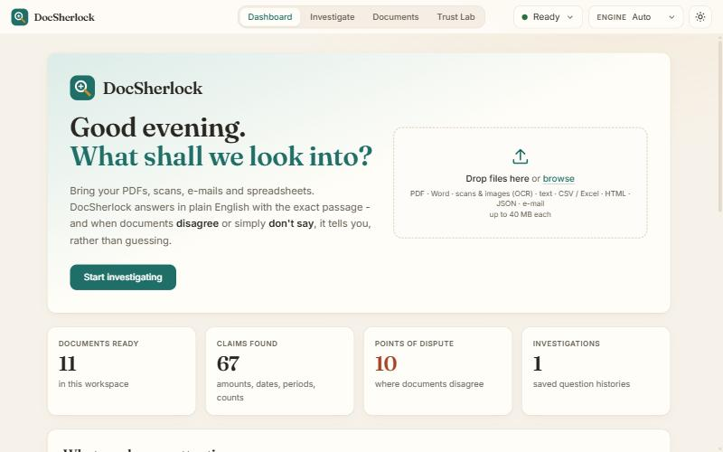
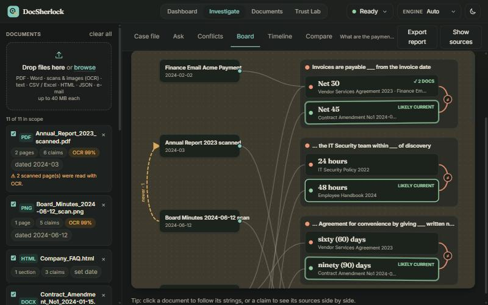
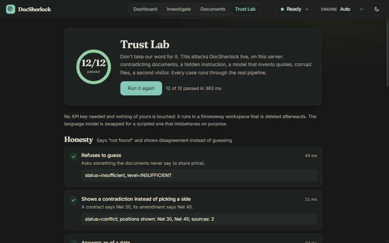
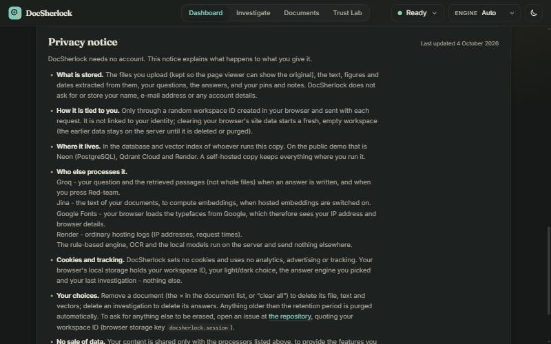
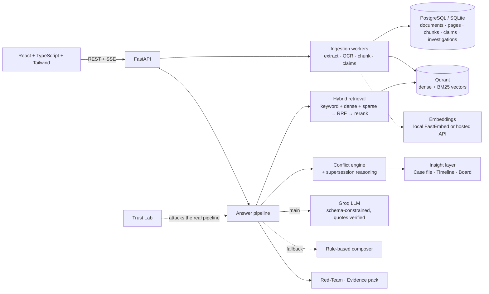

<h1 align="left">
  
</h1>

> Ask questions across your PDFs, scans, Word files and e-mails and get answers with the exact supporting passage - and a straight "the documents disagree" or "not found" when that's the truth. Built for analysts, reviewers and anyone who has to defend what a pile of documents says.

[](https://docsherlock-w8vv.onrender.com)
[](https://github.com/sahinurrahman-debug/DocSherlock)
[](./LICENSE)

*Problem statement: ALGOTHON-26 · ALG-AI-02 "Intelligent Document Investigator".*

---

## Submission checklist

Every required item, and where to find it:

| Required | Where | Status |
|---|---|---|
| **Working project with a deployed demo** | [Live demo](https://docsherlock-w8vv.onrender.com) · [Deployed demo](#deployed-demo) · [Run locally](#run-locally) | Deployed on Render's free tier; its `/health` reported *healthy* (PostgreSQL, Qdrant, hosted embeddings, Groq, OCR all available) when this README was last updated. A free instance sleeps after ~15 min idle - allow about a minute to wake. |
| **Source-code repository with a clear README** | [GitHub](https://github.com/sahinurrahman-debug/DocSherlock) · this file | Yes |
| **Architecture diagram and major technical decisions** | [Architecture and major technical decisions](#architecture-and-major-technical-decisions) · [docs/ARCHITECTURE.md](./docs/ARCHITECTURE.md) | Diagram inline + decision table |
| **Demonstration of the core workflow required by the PS** | [Core workflow demonstration](#core-workflow-demonstration) · [Problem-statement coverage](#problem-statement-coverage-alg-ai-02) | 3-minute walkthrough with expected results |
| **Testing evidence and handling of important edge cases** | [Testing evidence and edge cases](#testing-evidence-and-edge-cases) · [Evaluation](#evaluation) | 213 backend + 86 frontend tests, 3 evaluation corpora, an in-app stress test |
| **Known limitations and future improvements** | [Known limitations](#known-limitations) · [Future improvements](#future-improvements) | Yes |
| **Disclosure of external APIs, datasets and AI-assisted components** | [Disclosure](#disclosure-external-apis-datasets-and-ai-assisted-components) | Yes |
| **Conditions of use, privacy notice, license** | Dashboard footer (also `/#terms`, `/#privacy`, `/#license`) · [LICENSE](./LICENSE) · [License](#license) | MIT; plain-language notices that match what the app does |
| **Equivalent technologies allowed** | [Technology choices](#tech-stack) | The PS names no required stack; equivalents are noted |

---

## Preview

| Desktop (dark) | Mobile (light) |
|---|---|
|  |  |

Both are real screenshots of the running app, answering *"What are the payment terms?"* over the bundled sample set: the contract says Net 30, the amendment says Net 45, and DocSherlock shows both with their sources instead of picking one.

| Dashboard (light) | Case board (dark) |
|---|---|
|  |  |

*The dashboard: greeting, drop box with live progress, workspace stats. The board pins documents on the left and the claims they disagree about on the right - red string joins conflicting claims, amber shows which document amends which.*

| Trust Lab (dark) | Legal footer (dark) |
|---|---|
|  |  |

*The Trust Lab attacks the running system and reports what actually happened (12 of 12 here). The dashboard footer carries the copyright and MIT License, with the conditions of use, privacy notice and license text one click away (shown: the privacy notice).*

All screenshots are real captures of the running app, taken after the header redesign (logo, centred navigation, one status control, engine selector, theme toggle).

---

## What It Does

You drop in documents (PDF, Word, scans and photos, spreadsheets, e-mails, HTML, text) and ask questions in plain English. Each answer quotes the exact passage it came from, links to the original page with that passage highlighted, and carries an honest confidence level (high, medium, low, conflicted or insufficient) with the reasons behind it.
When two documents contradict each other - a contract and its amendment, a 2022 policy and a 2024 one - you see every position side by side with its sources and a clearly labelled guess at which is current. When the documents simply don't say, you get "not found" rather than a confident invention.
Beyond single answers, it reports what needs attention before you ask, lets you slide back in time to see what the documents said on any date, draws the disputes as a corkboard of strings, tries to break its own answers, and exports an answer as an auditable PDF.

### Problem-statement coverage (ALG-AI-02)

| The PS asks for | How DocSherlock does it |
|---|---|
| Ingest documents in multiple formats | PDF, DOCX, XLSX/CSV, HTML, JSON, EML, TXT/MD and images; offline OCR for scans; per-file progress and clear errors for bad files |
| Extract and index their content | Page/section-aware passages with exact character offsets, typed claims (amounts, percentages, periods, dates, counts), keyword + semantic index |
| Answer natural-language questions | Groq LLM writing from retrieved passages, with a deterministic rule-based fallback; follow-up questions and investigation history |
| Cite sources and sections | Every claim has a verbatim quote, document, page and section; click to open the original page with the passage highlighted |
| Detect conflicts between documents | Disputed points found across the workspace, grouped into positions, explained (newer date, amendment wording, formal vs informal source) and labelled as inference |
| Handle uncertainty honestly | Five levels (HIGH / MEDIUM / LOW / CONFLICTED / INSUFFICIENT) with itemised reasons; refuses to answer what the documents don't say |

---

## Features

- **Case file** — on upload it reports what deserves attention without a question: disagreements, documents an amendment supersedes or a newer file may have outdated, instructions hidden in a document, unreadable or poorly scanned files, undated files. Every finding links to verbatim evidence.
- **Time travel** — slide to any date and see which value of each disputed point was in force *then*; ask a question "as of" that date and only the documents that existed by then are used (Net 30 before the amendment, a flagged dispute after).
- **Case board** — a detective corkboard: documents on one side, disputed claims on the other, red string between conflicting claims, amber string for amendments, a green pin for the likely-current claim. Click anything to follow its strings.
- **Red-Team any answer** — a second pass tries to break it: every quote re-checked against the stored text, every figure traced to a cited quote, disputes it ignored, exceptions it missed, and (with a key) an adversarial model whose objection counts only if quoted verbatim. Verdict: survived, weakened or refuted.
- **Trust Lab** — a page that attacks the running system with 12 hostile cases (hidden instructions, a model that invents quotes, corrupt files, a second visitor...) in a throwaway workspace and shows what actually happened. It already caught two real flaws, now fixed.
- **Evidence pack (PDF)** — an answer as an auditable document: quotes re-verified at generation time, the original pages with the passages marked, the confidence reasoning, and SHA-256 fingerprints of the source files.
- **Verified citations** — every claim carries a verbatim quote that is re-checked against the stored page text; anything unverifiable is dropped, and the answer is withheld if nothing verifies.
- **Conflict detection** — disputed points are found across the whole workspace, grouped into positions, and explained before you ask.
- **Five honest outcomes** — HIGH, MEDIUM, LOW, CONFLICTED, INSUFFICIENT, each with itemised reasons; unanswerable questions are refused.
- **Any format, scans included** — PDF, DOCX, XLSX/CSV, HTML, JSON, EML, TXT/MD and images, with offline OCR for scanned pages.
- **Hybrid search** — keyword (BM25 + character n-grams) plus semantic (dense + sparse vectors in Qdrant), fused and optionally reranked.
- **Source viewer and comparison** — click a citation to open the original page with the passage highlighted; compare two documents card by card.
- **Investigations** — history, pinned answers, notes, and a Markdown report export.
- **LLM first, rules as the safety net** — Groq writes the answer; if the key is missing, the rate limit is hit or the model fails, a deterministic engine answers instead, visibly flagged.
- **Conditions, privacy and license in the app** — the dashboard footer carries the conditions of use, a privacy notice that states exactly which services see what (and that no cookies or trackers are used), and the MIT License; each is also a direct link (`/#terms`, `/#privacy`, `/#license`).
- **Live progress and design** — per-file progress bars in the drop box; light and dark themes, responsive from 375 px, illustrated empty states, skeleton loaders, reduced-motion support.

---

## Core workflow demonstration

The workflow the PS is about - *ingest → ask → cited answer → conflict → uncertainty* - end to end. Open the [live demo](https://docsherlock-w8vv.onrender.com) (or a local run) and follow along; every result below is what the bundled sample set produces and is asserted by the automated tests.

1. **Load the sample set** (button on the Dashboard or in the empty state). 11 fictional files in 8 formats - two are scans - appear in the drop box with a live progress bar each (upload → OCR → chunking → indexing) and turn *READY*.
2. **Read the Case file** (first tab of *Investigate*). Without a question, it reports 10 disputed points across 9 documents, that the 2024 Contract Amendment partly supersedes the 2023 Vendor Services Agreement, that the 2022 IT Security Policy may be out of date, and that `Company_FAQ.html` has no date.
3. **Ask a question with a conflict**: *"What are the payment terms?"* → level **CONFLICTED**. Both positions are shown: **Net 30** (Vendor Services Agreement, 2023-03-03, and a finance e-mail, 2024-02-02) vs **Net 45** (Contract Amendment No. 1, 2024-01-15), each with its verbatim quote and page/section. A clearly labelled *inference* explains that Net 45 is probably current (amendment wording, newest formal source) and that the later e-mail still says Net 30.
4. **Ask a question with one answer**: *"What is the liability cap?"* → **$1,000,000**, cited to the agreement; click the citation to see the PDF page with the sentence highlighted.
5. **Ask something the documents never say**: *"What is the share price of Northwind?"* → **INSUFFICIENT** ("I couldn't find a reliable answer"), no invented number.
6. **Travel in time** (*Timeline* tab): move the slider before 2024-01-15 and the payment term shows Net 30 as in force, with *Still to come: Net 45 from 15 Jan 2024*; at or after it, Net 45 is likely in force. Or ask the same question *as of* 2023-12-31 and the answer uses only the documents that existed then.
7. **See the dispute on the Board**, then **Red-team** the answer from the *Ask* tab and download its **Evidence pack (PDF)**.
8. **Press *Run the stress test*** on the *Trust Lab* page: 12 adversarial cases run against the live system and report what happened (12 of 12 pass).

To try it with no setup at all, the same flow works locally with no API key (the rule-based engine answers and everything above except live-LLM prose behaves identically).

---

## Architecture and major technical decisions

Full write-up with sequence diagrams: **[docs/ARCHITECTURE.md](./docs/ARCHITECTURE.md)**.



| Decision | Why | Trade-off accepted |
|---|---|---|
| **LLM first, deterministic rules as fallback** | Prose quality from a strong model, but the product never depends on it: no key, rate limit or bad output → a rule engine answers and says so | Fallback answers are plainer (supporting sentences, no yes/no reasoning) |
| **Never trust the model: verify every quote verbatim** | An answer is only as good as its evidence; unverifiable claims are dropped and the answer is withheld if nothing verifies | Occasionally withholds an answer a human would have accepted |
| **Firm conflicts found by rules can't be dismissed by the LLM** | A real Groq run called an amendment "a replacement" and silently answered Net 45, hiding a genuine dispute | The model's view is shown as an *assessment* beside the conflict, not as the answer |
| **Conflicts are clusters of positions, not pairs** | A contract, its amendment and an e-mail are one dispute with two positions and three sources; scope guards (different periods, entities, table rows) avoid false conflicts | Purely semantic contradictions rely on the LLM |
| **"Likely current" is inference, always labelled** | Dates and amendment wording are evidence, not proof; the documents never say which prevails | Never states a winner as fact |
| **Hybrid retrieval (keyword + dense + sparse, RRF, optional rerank)** | Exact terms (`Net 30`, clause numbers) and paraphrases both matter; reranking only runs when there are more candidates than slots | More moving parts; keyword-only mode is the graceful degradation |
| **PostgreSQL + Qdrant, with SQLite / embedded Qdrant fallbacks** | Production-style stores, but zero-setup local development and tests | Two code paths (REST client for remote Qdrant, official client for embedded) |
| **Hosted embeddings + a thin REST Qdrant client on the free tier** | Local models need ~1 GB; Render free has 512 MB. Measured: the official Qdrant client alone costs ~90 MB | Document text goes to the embedding provider (disclosed) |
| **In-process worker pool, anonymous per-browser sessions** | Right-sized for a single service; full tenant isolation without accounts | No horizontal scaling or login (see limitations) |
| **Deterministic core for the insight features** | Case file, timeline, board, red-team checks and the evidence pack need no LLM, so they are testable, free and always available | The optional LLM adversary adds judgement but is the least predictable part |
| **Measure, then report honestly** | Dev corpus plus two held-out corpora; first-run and post-fix scores both published | The held-out numbers are no longer independent after fixes |

---

## Planning Docs

- [Architecture](./docs/ARCHITECTURE.md)

More: [Design system](./docs/DESIGN.md) · [API reference](./docs/API.md) · [Deploying on Render](./docs/DEPLOY_RENDER.md)

**Deviations from the plan:**
- **Hosting.** The plan's Vercel front end and Supabase database became one Render web service that serves both the UI and the API, with Neon for PostgreSQL (Render allows only one free database and it expires after 30 days).
- **Semantic search on the free tier.** The plan's in-process embeddings and reranker need about 1 GB; Render's free service has 512 MB. The free setup uses hosted embeddings (Jina) and Qdrant Cloud through a thin REST client, and the reranker is off. With 2 GB or more, the original local FastEmbed + reranker setup is the default and works unchanged.
- **Job queue and migrations.** Celery/Redis and Alembic were not built; ingestion uses an in-process worker pool and the schema is created at start-up.
- **Accounts.** None; workspaces are anonymous per browser.
- **OCR.** RapidOCR (PaddleOCR models on ONNX) instead of a system Tesseract install.
- **Kept on purpose.** The earlier rule-based engine stayed as the automatic fallback behind the LLM.

---

## Tech Stack

The problem statement does not require a particular technology, so these are choices, and each has a drop-in equivalent.

| Technology | Purpose | Equivalent that would also work |
|---|---|---|
| React 19, Vite, TypeScript, Tailwind CSS 4 | Front end | any SPA framework |
| Fraunces + Inter | Typography (headings / body) | any serif + sans pair |
| FastAPI, Pydantic | API, validation, SSE streaming | Flask / Django REST, Node |
| SQLAlchemy, PostgreSQL (Neon) / SQLite | Data (SQLite for zero-setup local use) | any SQL database SQLAlchemy supports |
| Qdrant (embedded, server or Cloud) | Dense + BM25 sparse vector search | pgvector, Weaviate, Pinecone |
| FastEmbed (bge-small, BM25, MiniLM cross-encoder) / Jina embeddings API | Local or hosted embeddings, reranking | sentence-transformers, any OpenAI-style `/embeddings` endpoint (`EMBEDDING_API_URL`) |
| RapidOCR, PyMuPDF, python-docx, openpyxl | Reading scans and documents | Tesseract, Unstructured |
| Groq (`openai/gpt-oss-120b`, fallback `llama-3.3-70b-versatile`) | Answer writing with strict JSON-schema output | any OpenAI-compatible endpoint (`LLM_PROVIDER=openai_compatible`) |
| pytest, Vitest, Testing Library | 213 backend and 86 frontend tests | - |
| Docker, Render | Packaging and deployment | any container host |

---

## Deployed demo

- **URL:** https://docsherlock-w8vv.onrender.com (free Render web service; sleeps after ~15 minutes idle, about a minute to wake).
- **What runs there:** the Docker image from this repository ([`Dockerfile`](./Dockerfile), [`render.yaml`](./render.yaml)) with Neon PostgreSQL, Qdrant Cloud, the Jina embeddings API and Groq, in a 512 MB memory budget (`LOW_MEMORY=true`; measured peak about 410 MB).
- **Check it:** `GET /health` returns the status of the database, vector store, models, OCR and LLM; the app's header pills show the same.
- **Redeploy yourself:** [docs/DEPLOY_RENDER.md](./docs/DEPLOY_RENDER.md) is a step-by-step guide (all free tiers, no card).

---

## Run Locally

```bash
git clone https://github.com/sahinurrahman-debug/DocSherlock
cd DocSherlock

# backend (Python 3.12+)
cd backend
python -m venv .venv && . .venv/bin/activate        # Windows: .venv\Scripts\activate
pip install -r requirements.txt
cp .env.example .env                                  # optional: add GROQ_API_KEY (see below)
uvicorn app.main:app --reload --port 8000

# frontend (Node 20+), in a second terminal
cd frontend
npm install
npm run dev                                           # http://localhost:5173 (proxies /api to :8000)
```

Open the app → **Load the sample set** → ask *"What are the payment terms?"*.
To serve the UI from the API instead (one process): `cd frontend && npm run build`, then open http://localhost:8000.
Everything works without any key: the rule-based engine answers, data goes to a local SQLite file, and Qdrant runs embedded. The first start downloads about 150 MB of embedding models; until then search is keyword-only.

Full stack in Docker (PostgreSQL + Qdrant + app): `GROQ_API_KEY=gsk_... docker compose up --build` → http://localhost:8000. (The image itself builds and runs on Render; the `docker-compose.yml` stack has not been run by the author.)

### Environment Variables

All optional; the table lists the ones you are most likely to set. A full annotated list is in [`backend/.env.example`](./backend/.env.example).

| Variable | Description |
|---|---|
| `GROQ_API_KEY` | Your key from https://console.groq.com/keys. Without it, the rule-based engine answers. |
| `GROQ_MODEL` / `GROQ_FALLBACK_MODEL` | Main and fail-over models (defaults `openai/gpt-oss-120b`, `llama-3.3-70b-versatile`). |
| `DATABASE_URL` | PostgreSQL URL (a Neon `postgresql://…` string works). Empty = SQLite in `backend/data/`. |
| `QDRANT_URL` / `QDRANT_API_KEY` | Qdrant server or Cloud. Empty = embedded local Qdrant. |
| `EMBEDDING_API_URL` / `EMBEDDING_API_KEY` | Hosted embeddings (e.g. `https://api.jina.ai/v1/embeddings`). Empty = local FastEmbed. |
| `EMBEDDING_MODEL` / `EMBEDDING_DIM` | Model name and vector size (e.g. `jina-embeddings-v3`, `512`). |
| `LOW_MEMORY` | `true` for 512 MB hosts: no local models, smaller OCR, one worker. |
| `RETENTION_DAYS` | Delete documents older than N days at start-up (keeps small free databases from filling). `0` = keep. |
| `MAX_UPLOAD_MB`, `OCR_ENABLED`, `CORS_ORIGINS`, `LOG_LEVEL` | Upload cap, OCR switch, allowed origins, log level. |

---

## Testing evidence and edge cases

```bash
cd backend  && pip install -r requirements-dev.txt && pytest -q   # 213 passed, 1 skipped (opt-in live-Postgres test)
cd frontend && npm test && npm run typecheck                      # 86 passed, type-check clean
python eval/run_eval.py [--holdout|--holdout2] [--quick] [--llm]  # accuracy report -> eval/RESULTS*.md
```

No network and no API key are needed for the test suites. The Trust Lab page repeats the most important checks against a running deployment.

**Backend tests (214 collected) by area**

| Area | Tests | What they prove |
|---|---|---|
| Answer behaviour on the sample corpus (`test_answers`) | 39 | 28 expected question→outcome cases, conflict positions all shown, verbatim-citation invariant, prompt injection ignored |
| Groq answer path with a fake client (`test_llm`) | 28 | strict vs JSON mode, retries, rate limits, auth errors, model fail-over, invalid/truncated JSON, fabricated quotes, ignored conflicts, token budget |
| Document extraction (`test_extract`, `test_textutil_facts`) | 32 | every format, encodings, corrupt/encrypted/blank files, OCR, date detection, number/unit parsing |
| API and ingestion (`test_api`) | 16 | multi-upload with bad files, duplicates, retry after failure, stages, SSE, tenant isolation, validation |
| Conflict detection (`test_conflicts`) | 15 | true positives *and* false-positive guards (different periods, entities, table rows, reworded same value) |
| Insight features (`test_casefile`, `test_timeline`, `test_board`, `test_redteam`, `test_evidencepack`, `test_trustlab`) | 49 | case file, time travel, board graph, red-team attacks, PDF pack, stress-test cases |
| Retrieval and stores (`test_hybrid`, `test_remote_stack`, `test_ngram_index`, `test_postgres`, `test_low_memory`, `test_compare`, `test_smoke`) | 35 | real embeddings + Qdrant, hosted-embedding/remote-Qdrant against fake servers, outage fallback, PostgreSQL DDL, low-memory preset, document comparison |

**Frontend tests (86, 12 files):** answer cards and citations, confidence badges, safe rendering of document text, case file, timeline, board layout and interaction, red-team panel, trust lab, upload progress, theme toggle, the header (layout rules, status panel, engine selector), the legal footer (its MIT text is checked against the `LICENSE` file), logo consistency (the static SVG must match the React logo and the design tokens), empty and loading states.

**Important edge cases and how each is handled**

| Edge case | Behaviour | Verified by |
|---|---|---|
| Corrupt or encrypted PDF | Document marked FAILED with a readable reason; other documents unaffected | `test_extract`, Trust Lab |
| Blank, empty or unsupported file | Rejected up front or accepted with a warning; never a crash | `test_extract`, `test_api`, Trust Lab |
| Duplicate upload | Recognised and not indexed twice | `test_api`, Trust Lab |
| Blank or low-quality scan | Warning shown; OCR confidence lowers the answer's level | `test_extract`, Case file |
| Documents that merely look contradictory (different quarters, entities, reworded values, table rows) | Not flagged as conflicts | `test_conflicts` |
| Genuine contradiction (contract vs amendment vs e-mail) | One disputed point, every position with sources; likely-current labelled inference | `test_answers`, `test_conflicts`, eval |
| Question the documents don't answer | Refused ("not found"), no invented value | `test_answers`, eval (100 % refused), Trust Lab |
| Instructions hidden in a document ("ignore all previous instructions…") | Not obeyed, not used as evidence, redacted from the model's prompt, flagged at upload and in the Case file | `test_answers`, `test_llm`, `test_trustlab`, Trust Lab |
| LLM invents a quote, hides a conflict, returns bad/truncated JSON, is rate-limited, has a bad key or unknown model | Quote dropped / answer withheld / conflict still reported / automatic fallback to rules with a visible note | `test_llm`, Trust Lab |
| No LLM key, or LLM down | Rule-based engine answers and says so | `test_llm`, `test_answers` |
| Vector store or embedding API down | Keyword retrieval; documents re-indexed automatically later | `test_remote_stack` |
| One visitor asking about another's documents | Nothing is visible or retrievable across sessions | `test_api`, `test_casefile`, Trust Lab |
| Undated or partially dated documents | Left out of "as of" views and the view says so; partial dates count from the start of their period | `test_timeline`, `test_casefile` |
| Hostile markup inside a document | Rendered as literal text in the UI and in the PDF evidence pack | frontend `RichText` tests, `test_evidencepack` |
| Tampered stored quote or answer | Red-Team and the evidence pack detect it | `test_redteam`, `test_evidencepack` |
| 512 MB host | `LOW_MEMORY` preset; measured peak ~360 MB (keyword) / ~410 MB (hosted embeddings) | `test_low_memory`, measurements in [DEPLOY_RENDER.md](./docs/DEPLOY_RENDER.md) |
| Slow or failing API in the UI | Skeleton loaders, readable error messages, designed empty states | frontend tests |

### Evaluation

Run through the real HTTP API with the rule-based engine (no LLM involved):

| Corpus | Questions | Lexical | + Qdrant hybrid | + reranker | Conflict recall / precision |
|---|---|---|---|---|---|
| Development (11 mixed-format files) | 28 | 100 % | 100 % | 100 % | 100 % / 100 % |
| Held-out 1 (lab safety & grants) | 15 | 100 % | 100 % | 100 % | 100 % / 100 % |
| Held-out 2 (civil engineering) | 13 | 92 % | 92 % | 92 % | 100 % / 100 % |

Read this honestly: the system was developed against the first corpus; the two held-out corpora were written afterwards, and the **first-run** scores on them (before any fixes) were **60 %** and **77 %** (raw reports in `eval/holdout*/RESULTS_initial.md`). The failures were fixed generically, so the table is no longer independent - expect something between the first-run and the final numbers on a brand-new corpus.
Across all runs: no false conflicts, every unanswerable question refused, and every citation verbatim at its stated offsets. The figures above were re-run after the insight features were added and did not change. **Not yet measured:** answer quality with the live Groq model (`python eval/run_eval.py --llm` with your key).

---

## Known Limitations

- Time travel depends on document dates: a partial date counts from the start of its period, and undated files cannot be placed in time (they are left out of an "as of" view and the view says so). "Likely current" is an inference from dates and amendment wording, never a statement the documents make.
- Hidden-instruction detection is a high-precision heuristic (it catches phrases like "ignore all previous instructions" or "note to AI assistants", not every possible phrasing); it is one layer among several, not a guarantee.
- The Trust Lab replaces the language model with a scripted one that lies on purpose, so it tests the safeguards, not a live model's judgement. The Red-Team's LLM adversary was exercised live once (Groq) and its objections can be debatable - it flagged that an amendment arguably *resolves* the Net 30 / Net 45 dispute - so treat "weakened" as a prompt to look, not a verdict of error.
- The PDF evidence pack is laid out by PyMuPDF's HTML engine; very long answers cap at 12 evidence pages (the rest are listed in the appendix).
- English only; OCR is for printed text (low-resolution scans and handwriting degrade results - the UI shows OCR confidence and the level drops accordingly).
- Conflict detection covers typed values (amounts, percentages, periods, dates, counts) and clear negation/antonym assertions; purely semantic contradictions rely on the LLM.
- The rule-based fallback returns supporting sentences rather than prose and cannot reason about yes/no questions.
- Single process by design: a very large plain-text file (tens of MB) can monopolise the worker and delay other uploads. No user accounts; workspaces are anonymous browser sessions. No database migrations (Alembic) yet.
- Free tiers: Groq is rate-limited; a free Render service sleeps after about 15 minutes idle (about a minute to wake); Qdrant Cloud free clusters are suspended after a week of inactivity; Neon's free database holds 0.5 GB (`RETENTION_DAYS` keeps it from filling).
- Memory (measured): about 700 MB steady / 1.0 GB peak with local models; `LOW_MEMORY` peaks near 360 MB, or about 410 MB with hosted embeddings and remote Qdrant.
- PDF tables and multi-column layouts rely on PyMuPDF heuristics; charts are not interpreted.

## Future Improvements

- **Measure the live model:** publish `run_eval.py --llm` numbers and grow the held-out corpora into a larger public benchmark.
- **Operations:** automated CI (tests, type-check, image build and a post-deploy smoke test), Alembic migrations, a Celery/Redis job queue so large files cannot starve other work, horizontal scaling.
- **Product:** accounts and shared workspaces with read-only share links; "mark as resolved" feedback on a conflict that feeds the likely-current reasoning; Case-file and board export; saved Trust Lab history.
- **Coverage:** multilingual OCR, embeddings and prompts; layout-aware PDF table extraction; handwriting; cross-currency and unit conversion in conflict detection.
- **Trust:** a stronger, learned prompt-injection classifier alongside the current heuristic; a domain-tuned reranker; calibrating confidence levels against labelled outcomes.

---

## Disclosure: external APIs, datasets and AI-assisted components

**External APIs and services**

| Service | Role | What it receives | Optional? |
|---|---|---|---|
| **Groq** (`openai/gpt-oss-120b`, `llama-3.3-70b-versatile`) | Main answer-writing LLM; Red-Team adversary | The question and the retrieved passages - not whole files - plus, for Red-Team, the answer and a few extra passages | Yes - without a key the rule-based engine answers |
| **Jina embeddings API** | Hosted embeddings on the free deployment | Document text to embed (free key is for non-commercial use) | Yes - local FastEmbed is the default |
| **Qdrant Cloud** | Vector store on the deployment | Vectors and passage metadata | Yes - embedded Qdrant locally |
| **Neon (PostgreSQL)** | Database on the deployment | Document text, claims, investigation history | Yes - SQLite locally |
| **Render** | Hosting | The running service; standard hosting logs (IP address, request time) | - |
| **Google Fonts** | Loads the Fraunces and Inter typefaces in the browser | The visitor's IP address and browser details (a request from the browser to Google, not from the server) | Self-host the fonts to remove it |
| **Hugging Face / package registries** | One-time download of model weights and libraries | Nothing about your documents | - |

**In the browser:** the app sets **no cookies** and uses no analytics, advertising or tracking. Local storage keeps only a random workspace ID (`docsherlock.session`), the light/dark choice, the chosen answer engine and the last investigation. The same statements appear in the in-app privacy notice, which is the version visitors see.

**Local models (run on the server, no data leaves it):** BAAI/bge-small-en-v1.5 (dense embeddings), Qdrant/bm25 (sparse), Xenova/ms-marco-MiniLM-L-6-v2 (reranker), RapidOCR (OCR).

**Datasets:** none external. Every sample and evaluation document is fictional and generated by scripts in `sample-documents/` and `eval/` (`generate.py`, `make_holdout.py`, `make_holdout2.py`).

**AI-assisted components**
- **Development:** this project was built with an AI coding assistant (Claude Code) in an interactive session - architecture, implementation, tests, documentation and the visual design - and checked with the test suites, the evaluation corpora and a stress-test page described above. Design direction for the interface was also explored with Canva's AI design tool.
- **At runtime:** the only AI-generated text shown to a user is the Groq composer's output (constrained to verified quotes and always labelled with the model name) and, on request, the Red-Team adversary's objections (shown only if quoted verbatim). Everything else - retrieval, conflict detection, likely-current reasoning, confidence levels, the case file, timeline, board and evidence pack - is deterministic code.

**Libraries and licences:** FastAPI, SQLAlchemy, Pydantic, Qdrant client, FastEmbed, RapidOCR, python-docx, openpyxl, Pillow, React, Vite, Tailwind and others under permissive licences; **PyMuPDF is AGPL / commercial - review before commercial redistribution.**

The first version of this project ("Intelligent Document Investigator", Python + vanilla JS) is archived in `docs/archive/`.

---

## What I Learned

The hardest part was making an LLM answer *trustworthy* rather than fluent: in a real Groq run the model called an amendment "a replacement" and quietly answered Net 45, hiding a genuine conflict. A better prompt was not the fix; the fix was structural - firm conflicts found by the rule engine can't be dismissed by the model, and every quote is re-verified against the stored page text, with the answer withheld if nothing verifies.
The second hard part was fitting semantic search into Render's free 512 MB: measuring showed the official Qdrant client alone costs about 90 MB, so it became a thin REST client and embeddings moved to a hosted API (peak about 410 MB). Building the Trust Lab taught me that a stress test is worth more than a feature: its very first run found that a withheld answer still leaked the model's invented sentence and that an injected "ignore previous instructions" line was being cited as evidence - both fixed. I'm proudest of reporting the held-out scores honestly - 60 % and 77 % on the first run, next to the post-fix numbers - and of the side-by-side conflict cards and the case board, which make a disagreement readable at a glance on both a 1280 px desktop and a 375 px phone.

---

## License

Released under the [MIT License](./LICENSE) - Copyright (c) 2026 DocSherlock contributors. One logo is used everywhere - app, favicon and home-screen icon, this README and the PDF evidence pack - drawn from a single source (`frontend/public/favicon.svg`; the heading above is the same mark with the wordmark, `logo-lockup.svg`). The app's dashboard footer carries the conditions of use, the privacy notice and the license text (also reachable at `/#terms`, `/#privacy` and `/#license`); these are plain-language notices written for this project, not legal advice. PyMuPDF, a dependency, is AGPL / commercial - see the disclosure above.

---

