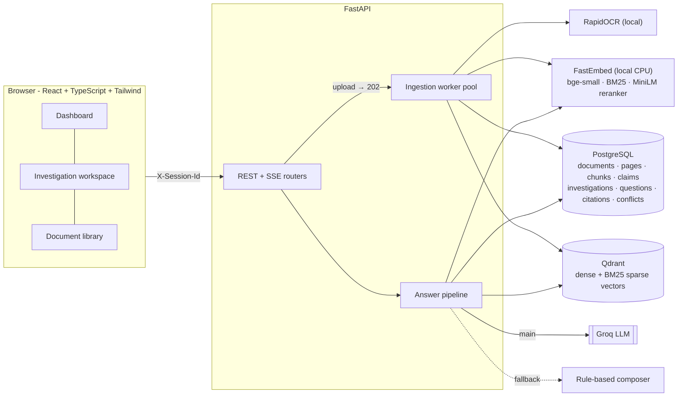
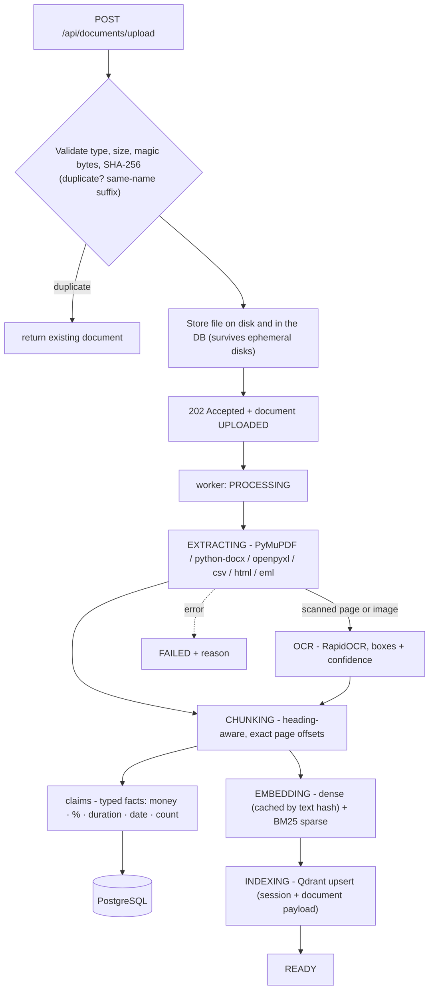
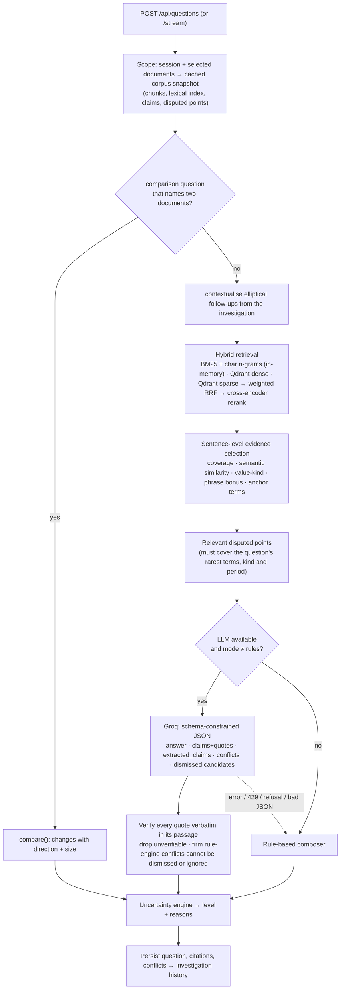

# DocSherlock - Architecture

## 1. System overview

## 2. Ingestion (background, with visible stages)

Stages and a progress percentage are stored on the document row; the UI polls while anything is busy. If the embedding models are not ready yet (first start) the
document becomes READY with keyword retrieval only and is **back-filled automatically** when the models load; at start-up `reconcile_vectors()` re-queues any
document whose vectors disappeared (wiped Qdrant volume, new cluster).

## 3. Answering

## 4. Data model

| Table | Purpose | Notes |
|---|---|---|
| `documents` | one row per upload | status/stage/progress, hash, OCR confidence, document date (+ source), warnings, original bytes (`file_blob`) |
| `pages` | extracted text per page | OCR boxes and image size for highlight rendering |
| `chunks` | retrieval units | page, section, `start_char/end_char` into the page text |
| `claims` | typed sentence-level claims | subject, kind, value + full serialised fact (qualifiers, local context) |
| `embedding_cache` | dense vectors keyed by `sha1(model + text)` | re-uploads and re-indexing are free |
| `investigations` / `questions` | case history | answer payload (JSON), level, pinned, note |
| `citations` / `conflicts` | per-answer evidence | exact offsets, role (support/conflict/lead); disputed-point JSON |

All rows carry `session_id`; every query and every Qdrant search is filtered by it.

## 5. Key design decisions

**LLM first, deterministic safety net.** Groq writes the answer because it reads paraphrases and reasons about yes/no questions; but it is a *composer on top of verified evidence*, not a
source of truth. The system prompt forbids outside knowledge and marks passages as untrusted data; the output is schema-constrained; every quote is re-checked against the stored page
text. A *firm* rule-engine conflict (high severity, different documents, same period) is never dismissed or ignored by the model: it is reported from the verified positions with the model's view attached as an "assessment" - the rule engine produced no false conflicts on any evaluation corpus, whereas "the later document wins" is exactly the silent winner this product exists to prevent (a real Groq run showed the model calling an amendment "a replacement" and answering "Net 45" with no mention of Net 30). Any failure (no key, 401, 429, timeout, refusal, malformed or truncated JSON) falls back to the rule-based composer, and the reason is shown to the user. Short rate limits
(`retry-after ≤ 6 s`) are waited out; model errors fall over to a second model.

**Retrieval returns relevance, not just a ranking.** A high rank in a corpus that doesn't contain the answer must not look confident, so retrieval also produces term coverage
(IDF-weighted) and calibrated dense similarity; the uncertainty engine combines those with corroboration, unknown terms ("cfo"), OCR quality and conflicts.

**Qdrant for vectors, lexical statistics in memory.** Qdrant holds dense and BM25 sparse vectors with tenant filters. The scoped lexical index (BM25 with stemming/synonyms/acronyms,
character n-grams) is built per workspace snapshot and also supplies the absolute relevance signals and the corpus statistics (IDF, "is this term in any document?") that abstention depends on.
The cross-encoder only runs when there are more candidates than slots.

**Typed claims make conflict detection precise.** `sixty (60) days` = `2 months` = `60 days`; `Net 30`; `weekly` = every 7 days; `$1.5 million` vs `$1,250,000`. Two claims conflict when their subjects
match and no pair of values is compatible. Guards keep false positives near zero (scoping qualifiers such as quarters/entities/years, as-of dates, table rows, actual-vs-spec values).
Pairwise conflicts are clustered into disputed points with positions, then explained: newer date, amendment wording, formal vs informal source, same-document inconsistency, time-scoped values.

**Grounding is an invariant.** Chunks are exact slices of page text; citations carry absolute offsets; a test asserts that every citation produced for the whole evaluation set equals the
stored page text at its offsets. The viewer highlights PDFs by text search and scans by drawing the OCR boxes that make up the quote.

**Derived data is recomputable.** Chunks/claims come from stored page text; embeddings are cached; Qdrant is rebuildable. A parser fix never needs a re-upload.

## 6. Security and privacy
* Upload allow-list, size limit, magic-byte checks, sanitised file names, PDF page cap; corrupt/encrypted files become a `FAILED` row with a reason - a bad file never breaks a batch.
* Tenant isolation by session id on every table and every vector query; sessions are random 24-hex ids generated in the browser.
* The UI never uses `innerHTML` for document text (verified by tests); documents reach the LLM only inside `<passage>` tags.
* API keys live only in the backend environment. With a key set, the question and retrieved passages (not whole files) are sent to Groq.
* **Not in scope:** user accounts/authentication (anyone with the URL and a fresh browser gets an empty private workspace; there is no login or sharing).
