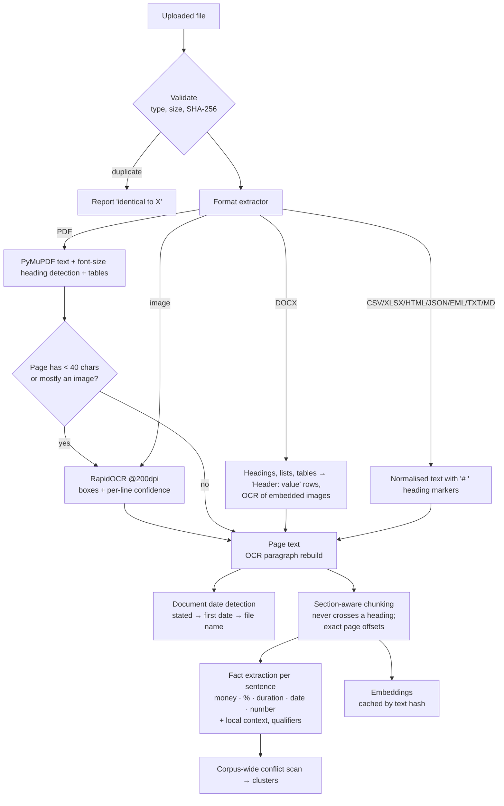
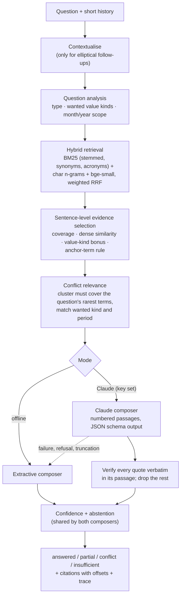

# Architecture

Intelligent Document Investigator turns a pile of mixed-format documents into something you can **interrogate**: answers are
grounded in exact passages, disagreements between documents are surfaced instead of hidden, and "the documents don't say"
is a first-class answer.

## 1. System overview

```mermaid
flowchart LR
    subgraph Client["Browser UI (vanilla JS, no build step)"]
        U1[Upload / demo loader]
        U2[Ask + answer cards]
        U3[Conflict board]
        U4[Source viewer<br/>page image + highlight]
        U5[Notebook + report export]
    end

    subgraph API["FastAPI (investigator/app.py)"]
        R1["/api/documents"]
        R2["/api/ask"]
        R3["/api/conflicts"]
        R4["/api/documents/{id}/pages/{n}[/image]"]
        R5["/api/notebook[/export]"]
    end

    subgraph Engine["Engine (investigator/engine.py)"]
        direction TB
        ING[Ingestion pipeline]
        IDX[(Index<br/>chunks + facts)]
        CON[Conflict engine<br/>+ clustering]
        QA[Analyzer + composers]
    end

    DB[(SQLite + original files<br/>pages, embeddings, notebook)]
    LLM[[Claude API<br/>optional]]

    Client --> API --> Engine
    ING --> IDX
    IDX --> CON
    IDX --> QA
    CON --> QA
    ING <--> DB
    QA -. "only if ANTHROPIC_API_KEY" .-> LLM
```

## 2. Ingestion pipeline

*Everything derived (chunks, facts, conflicts) is recomputed from stored page text on start-up; only page text, the
original file and embeddings are persisted.* A document date edited in the UI therefore re-runs conflict reasoning.

## 3. Query pipeline

## 4. Key design decisions

### 4.1 A deterministic core, with the LLM as an optional upgrade
The platform works with **no API key and no network** (after the one-time embedding download): retrieval, OCR, conflict
detection, confidence and abstention are all local and reproducible. That makes the demo robust, the behaviour testable
(105 tests, zero flakiness from model drift), and every judgement auditable ("How was this found?" shows the trace).
Claude then adds what a rule engine cannot: paraphrase-level reading comprehension, yes/no reasoning, and adjudication of
conflict candidates. It is a *composer on top of verified evidence*, not a source of truth:

* it only sees numbered passages; the system prompt forbids outside knowledge and treats passage text as untrusted data
  (prompt-injection posture, covered by a test with a hostile document);
* its output is schema-constrained JSON; every claim must carry a **verbatim quote** from the cited passage, which we
  check (whitespace/quote-style tolerant). Unverifiable quotes are dropped, confidence is reduced, and if no verifiable
  support remains the answer is withheld;
* its self-reported confidence is blended with, never substituted for, the evidence-based score;
* refusal, truncation, timeouts or API errors fall back to the extractive composer, with a visible note.

### 4.2 Retrieval produces *relevance*, not just a ranking
A top-ranked passage in a corpus that doesn't contain the answer must not look confident. Retrieval therefore returns
absolute signals alongside the ranking: IDF-weighted **term coverage** of the question and (when embeddings are on)
calibrated **cosine similarity**. Confidence is built from those, from corroboration across documents, from terms that
appear in *no* document ("cfo", "share price"), from OCR quality of the cited source, and is capped when sources conflict.
Below a threshold the system abstains and shows only "closest passages (not an answer)".

### 4.3 Conflict detection = same subject + incompatible typed values, with scope guards
Free-text contradiction detection is hard; typed values make it precise. Every sentence is parsed into money,
percentages, durations (normalised: "sixty (60) days" = "2 months" = 60 days; "Net 30"; "weekly" = every 7 days),
dates and counts. Two statements conflict when their subjects match **and** no pair of values is compatible. The guards
that keep false positives near zero:

| Situation | Behaviour |
|---|---|
| "Q1 revenue $5M" vs "Q2 revenue $7M"; fiscal years; named periods | not a conflict (scoping qualifiers) |
| "Alice's salary $90k" vs "Bob's salary $95k" | not a conflict (different subjects) |
| "As of Dec 2023: 142 staff" vs "As of Jun 2024: 128 staff" | not a conflict (as-of dates scope the statement) |
| "achieved 42 MPa" vs "minimum spec 40 MPa" (same document) | not a conflict (no shared subject) |
| rows of one table | never compared with each other |
| "60 days" vs "2 months" | not a conflict (unit-aware tolerance) |
| document-level date differs (no sentence date) | still reported, labelled "may reflect change over time" |
| assertion pairs (mandatory/optional, approved/rejected, negation) | reported as `assertion` with lower severity |

Pairwise conflicts are then **clustered into disputed points with positions** (contract: Net 30, amendment: Net 45, e-mail:
Net 30 → *two positions, three sources*), which is how a human would read it.

### 4.4 Never pick a silent winner - but do reason about it
For each disputed point the resolution note separates *what the documents state* from *what might explain it*:
newer document date, amendment/supersession wording, formal-vs-informal source (a later e-mail does not override a formal
amendment, but is flagged as evidence the change may not have been applied), same-document inconsistency, time-scoped
values, draft/obsolete file names, low OCR confidence. It always ends with "no document explicitly says which prevails -
confirm", and the user can correct the document date in the UI, which immediately re-runs the reasoning.

### 4.5 Source grounding is an invariant, not a hope
Chunks are exact slices of page text (`page_text[start:end]`), sentences are exact sub-slices, and citations carry those
absolute offsets. The viewer highlights the exact span: for PDFs via text search on the rendered page, for scans/images by
drawing the OCR boxes that make up the quote. A test asserts that for every question in the eval set, every citation's
quote equals the stored page text at its stated offsets.

### 4.6 Persistence model
SQLite stores documents, extracted pages (+ OCR boxes), embeddings (keyed by text hash) and the notebook; originals are
kept on disk for the viewer. Chunks, facts and conflicts are *derived* on start-up - no migration burden, and fixing an
extraction bug never requires re-uploading.

## 5. Module map

| Module | Responsibility |
|---|---|
| `extract.py`, `ocr.py` | Format extractors, PDF heading/table detection, per-page OCR fallback, OCR paragraph reconstruction, document-date detection |
| `chunking.py` | Heading-aware chunks that never cross sections, exact offsets |
| `facts.py` | Typed quantity extraction, local context, qualifiers, concept canonicalisation |
| `conflicts.py` | Candidate generation, similarity, guards, value/assertion comparison, clustering, resolution reasoning |
| `retrieval.py` | BM25 + char n-grams + optional dense embeddings, synonyms/acronyms, relevance signals |
| `answer.py` | Question analysis, evidence selection, conflict relevance, confidence, extractive composer |
| `llm.py` | Claude composer, JSON schema, quote verification, conflict adjudication |
| `engine.py`, `store.py` | Orchestration, persistence, notebook |
| `report.py`, `app.py`, `static/` | Markdown report, REST API, UI |

## 6. Security & privacy notes

* Uploads: extension allow-list, size limit (default 40 MB), PDF page cap, file names sanitised, content-hash de-duplication;
  encrypted/corrupt files are rejected with a clear message rather than crashing a batch.
* The UI never uses `innerHTML` with document text (all DOM built with `textContent`), so a hostile document cannot inject script.
* Documents stay on the machine in offline mode. With `ANTHROPIC_API_KEY` set, retrieved *passages* (not whole files) are
  sent to the Anthropic API; the UI shows which engine answered each question.
* No authentication/multi-tenancy: this is a single-user investigation workbench (see limitations).
